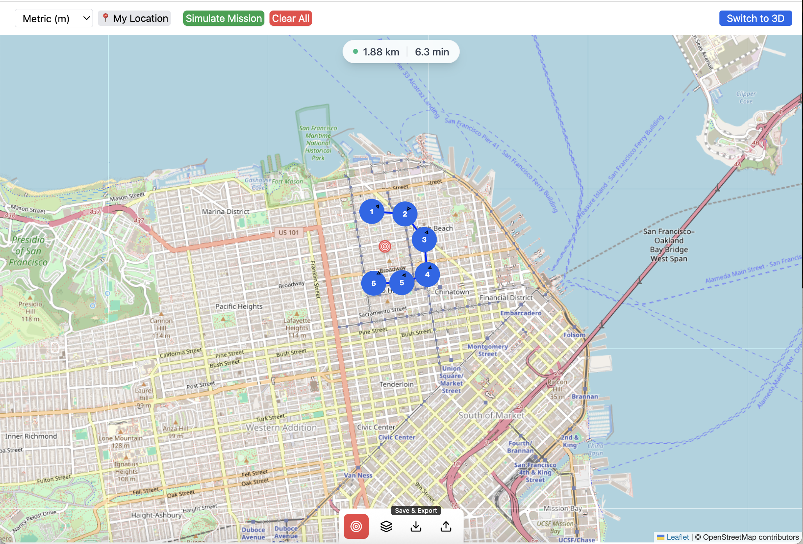
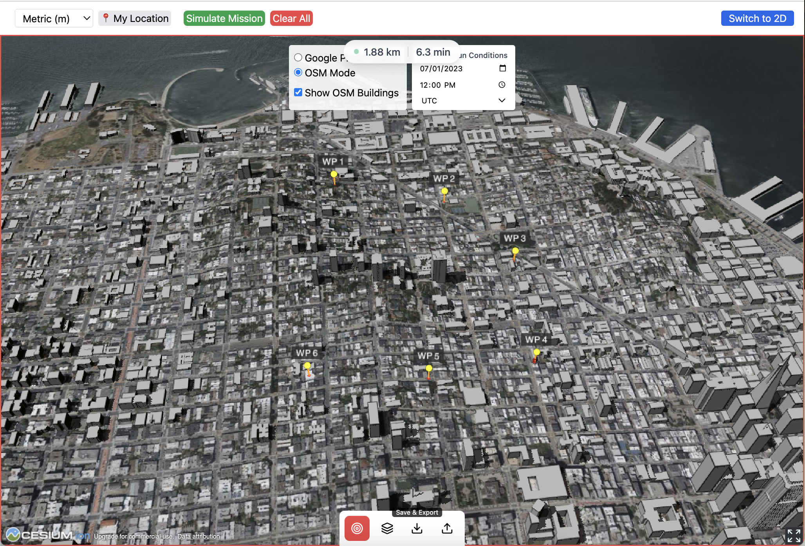

# 2D/3D Drone Planner

_Last updated: May 21, 2025_

## 🌐 Live Demo

You can try the app live here:  
👉 [https://drone-app-q23f.vercel.app](https://drone-app-q23f.vercel.app)

## 📖 Overview

This tool was designed for hobbyist and commercial drone pilots to pre-plan detailed flight paths in both 2D and 3D environments. It allows users to drop waypoints, simulate drone paths, and visualize terrain and urban environments in real time.

The 3D map is powered by **CesiumJS**, while the 2D interface uses **Leaflet**.

> This project is part of my journey transitioning into full-time software engineering. It combines my interest in geospatial interfaces with modern web development tools.

## ⚙️ Tech Stack

### Frontend
- **Framework:** React  
- **Dev Server & Bundling:** Vite  
- **Styling:** Tailwind CSS  
- **2D Map Engine:** Leaflet via `react-leaflet`  
- **3D Globe Engine:** CesiumJS (accessing the Google Photorealistic 3D Tiles and OSM Buildings through Cesium Ion)
- **Mapping Integrations:**  
  - [CesiumJS](https://cesium.com/platform/cesiumjs/) provides a photorealistic global tileset and optional building metadata.
  - [OpenStreetMap Buildings](https://cesium.com/learn/ion-sdk/osm-buildings/) (some buildings include height estimates, number of stories, and other metadata via community contributions).

### Backend
- Currently in progress (future plans include route saving, user accounts, and backend metrics).

## 🔧 Rebuilding the Project (Optional)

You’re welcome to fork and rebuild this project!  
**However**, it currently assumes front-end only deployment with no custom backend services.

To host it yourself, you'll need:

1. A **Cesium Ion account** (free tier available)  
   - This will give you access to the Google Photorealistic Tileset and OSM Buildings.
2. A **`.env` file** with your Cesium access token  
   - The frontend reads this at build time to initialize the Cesium viewer.

> Note: This project is still under active development. If you plan to extend or customize it, I recommend exploring the CesiumJS and Leaflet docs, as well as libraries like Resium and react-leaflet.

## 🧠 Why I Built This

I wanted to challenge myself to build an interactive geospatial planning tool using real-world mapping data. This project also reflects my interest in autonomous systems and responsive interfaces — and serves as my flagship project as I transition from SaaS sales into full-stack engineering.

## 🛠 Planned Features / TODO
- Backend integration (saving/loading missions)
- Mission export (GeoJSON or DJI-compatible)
- Per-waypoint speed and heading settings
- Altitude profile visualizations
- UI/UX cleanup + mobile responsiveness

## 🖼 Screenshot
**2D Planner View**

**3D Planner View**

